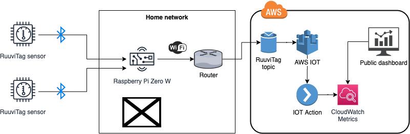
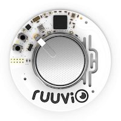
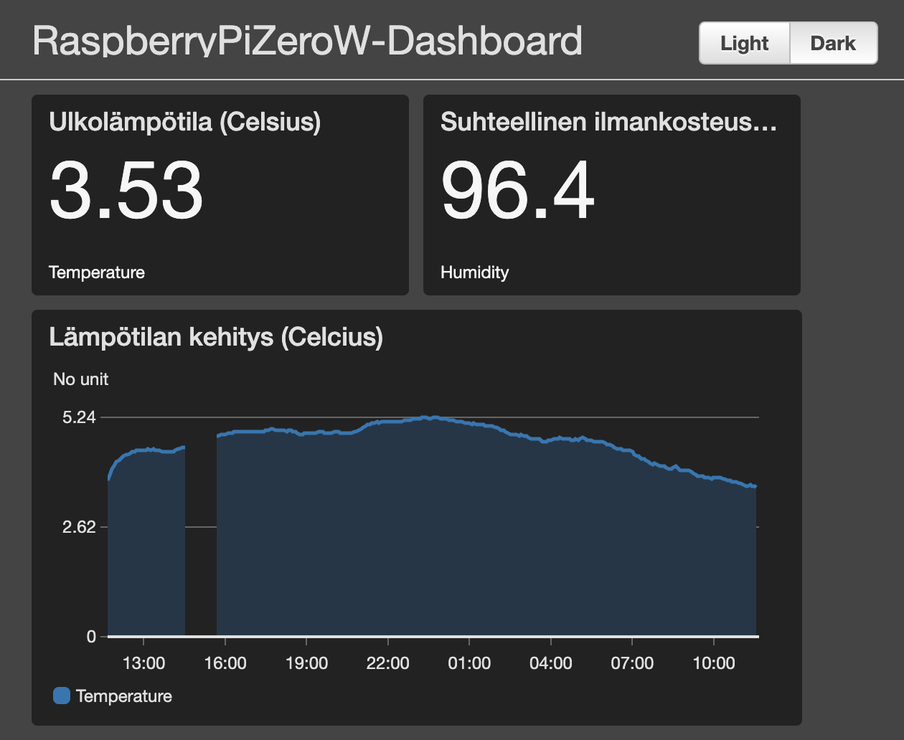

# Building a RuuviTag weather monitoring dashboard using AWS IOT

What you'll need for this:

* An AWS account <https://console.aws.amazon.com>
* A RuuviTag device <https://shop.ruuvi.com>
* A Raspberry Zero W (or a larger one) <https://raspberrypi.org/products/raspberry-pi-zero-w>



## Setup

### 1. RuuviTag



Just unbox the Ruuvitag and verify the functionality with RuuviStation mobile application.

### 2. Raspberry Pi Zero W

Check out the headless setup instructions <https://www.raspberrypi.org/documentation/configuration/wireless/headless.md>.

Note: You might want to login using SSH keys instead of the default username/password combo.

### 3. Setup this repository to Raspberry Pi device

1. Install Node.js
    * Use NVM <https://github.com/nvm-sh/nvm>
2. `git clone https://github.com/markusl/ruuvitag-aws-iot-monitoring.git`
3. Install the prerequisites:

    ```sh
    cd app-old/
    sudo apt-get install libudev-dev libusb-1.0-0-dev
    npm install
    ```

4. Enable bluetooth access without sudo (<https://github.com/sandeepmistry/noble#running-on-linux>)

    ```sh
    sudo setcap cap_net_raw+eip $(eval readlink -f `which node`)
    ```

5. Enable automatic startup on boot: `sudo nano /etc/rc.local` and add

    ```sh
    PATH=$PATH:/home/pi/.nvm/versions/node/v16.17.0/bin && cd /home/pi/ruuvitag-aws-iot-monitoring/app-old && sh start-monitoring.sh &
    ```

### 4. Configure AWS IoT device

Open `awsiot/bin/awsiot.ts` and configure the relevant RuuviTag id's for AWS IoT event rules.

Then deploy the AWS IoT cloud infrastructure:

```sh
cd awsiot/
npm i -g aws-cdk
npm install
# Deploy the IoT device configuration
cdk deploy AwsIotStack
# Deploy the CloudWatch dashboard
cdk deploy AwsIotDashboardStack
```

### 5. Configure and run the application

1. Go to AWS Secrets Manager in AWS Console and look for `RaspberryPiZeroW-Credentials`.
2. Use the Retrieve Secret Value button to get `certificatePem`, `privateKey` and `publicKey`.
3. Configure proper keys under `keys`.
4. Update proper endpoint and client id in `start-monitoring.sh`

Run the application:

```sh
sudo apt-get install screen
screen app-old/start-monitoring.sh
```

### 6. Configure CloudWatch dashboard for sharing

You can share the created dashboard publicly in the AWS CloudWatch console.


